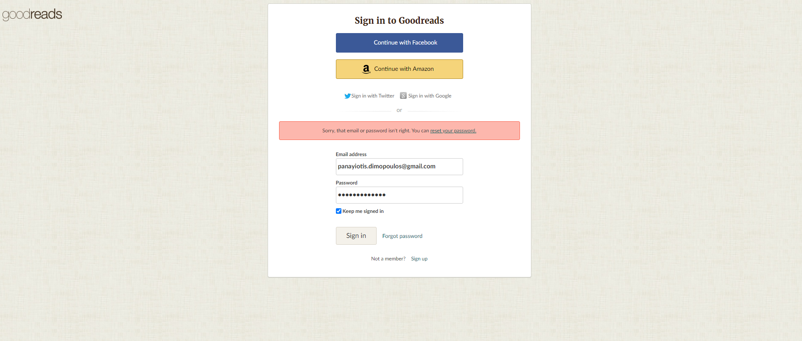

# **aAGoodreads Features**

## **Team Members and Roles:**

**Jerel Smith:** Model Lead
**Dylan Besonen:** UX Lead
**Panayiotis Dimopoulos:** Project Lead

## **Required Features:**

+ ### **Books**

    *As a user, I want to be able to access a log of books and their descriptions so that I can make a decision on whether or not I want to read them.*

    **Development Estimate:** 2 1/2 days

     
    

    *As a user, I want a central place to access my collection of books so that I can add more and keep them all organized.*

    

+ ### **Bookshelves**

    *As a user, I want to be able to organize my books into various bookshelves so that I can categorize books that I have read, am reading, or want to read however I choose.*

    **Development Estimate:** 1 1/2 days

    

+ ### **User Authentication**

    *As a site user, I want to be able to log in so that I have a personalized "Goodreads" experience.*

    **Development Estimate:** 1 1/2 days

     
    

+ ### **Reviews**

    *As a user, I want to be able to post and track reviews of books so that I can give and receive opinions on why I should or should not read any given book.*

    **Development Estimate:** 1 day

    

+ ### **Read Status**

    *As a user, I want to be able to update the status of the books I'm reading/have read so I that I can keep track of what books I have previously read.*

    **Development Estimate:** 1 day

    

## **Bonus Features:**

+ ### **Homepage**

    *As a user, I want to be able to view a personalized homepage so that I have a more enjoyable experience.*

    **Development Estimate:** 1/2 day

    

+ ### **Browse**

    *As a user, I want to be able to find books similar to ones I've read/by genre so that I can continue to read books that I find enjoyable.*

    **Development Estimate:** 1 day

    

+ ### **Authors**

    *As a user, I want to be able to find all the books that the authors who wrote my favorite books have written so that I can continue to find more books that I enjoy.*

    **Development Estimate:** 1/2 day

    

+ ### **Series**

    *As a user, I want to be able to find the next book in a series that I'm reading with relative ease so that I don't have to leave the site to find out what it is.*

    **Development Estimate:** 1/2 day

    

## **Database Schema Mockup:**

